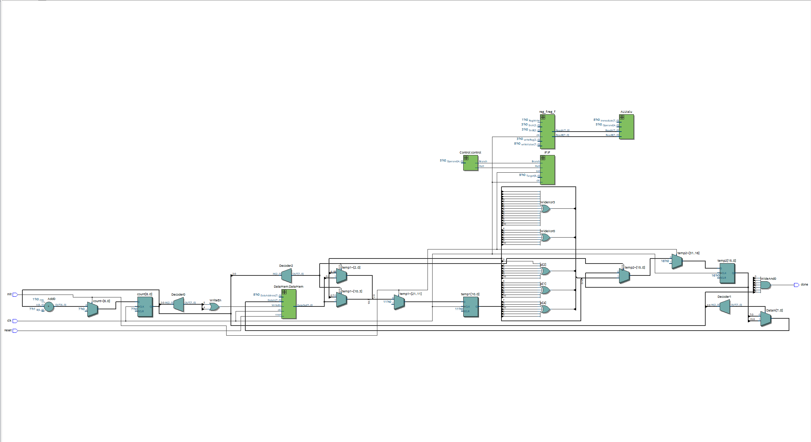
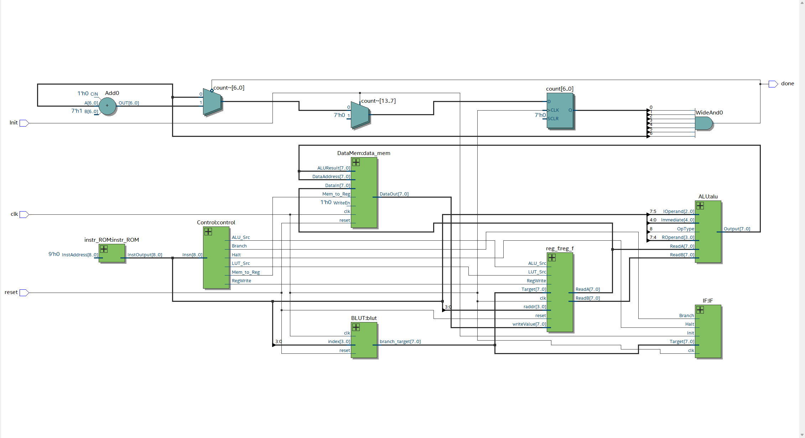

# sp23-cse141-project
 
## Team Members:
- **Thinh Vo A17604559**
- **Duy Nguyen A16558043**

### Explain which programs/features work:

The only program that we really get to implement is program #1 which performs forward error correction block coder also known as a **transmitter**. To perform this task, we chose to create a pseudo-accumulator machine which only requires us to update the value at *register 0* and with that, it frees up a lot of bits that we can utilize for things like **Opcode, operand registers, and immediates**. Our processor takes the random original messages that get generated by the testbench and transform it into new messages which is just the orignal messages with the parity bits added onto the them. The logic behind calculating each parity bits (p0, p1, p2, p4, p8), we found from this [Wikipedia article](https://en.wikipedia.org/wiki/Hamming_code).

### Explain which programs/features don't work and what challenges you faced when implementing your design:

As we explained above, the first program is the only one that we get to work and it took us the entire quarter. Our group is not too familiar with System Verilog, we had some difficult times researching and working with on code to work on Quartus making sure that it at least compiled. After it finally compiled, we realized that some of the components didn't work correctly. Specifically, the **program counter** posed significant problems, we had to go back and forth between observing the waveform, fixing the source codes, and adjusting the testbench to fix the problems. The **ALU** was also troublesome to implement and test, but it wasn't as bad as the program counter.

After we felt like we had all the components running as we expected, we moved onto working on the top level design of our CPU. Most amount of problems that we had during this process. In the beginning, we just carelessly creat logic signals that all the other modules required, we didn't really think about the relationship between all the components which result in an extremely unpleasant schematic [Picture 1](#schematic-1). Everything is incoherent, and the result of that is a program that executess forever. Because of that, we had to go back and map out all the relationship between these components. This helps make our schematic looks a lot better, as you can see in [Picture 2](#schematic-2).

Regrettably, due to time constraints, we were unable to implement programs 2 and 3. Given more time, we believe we could have achieved this.

### Link to our group's video:

[CSE141L-Project-Demo](https://youtu.be/azPdiOcr0Zg)

### Schematic 1:

### Schematic 2:

